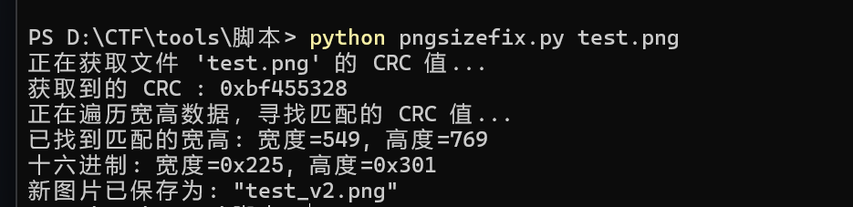
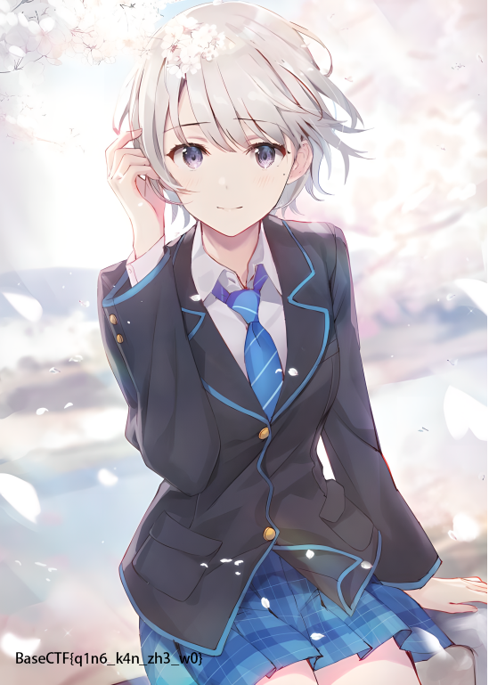

# CTF_png_size_fix
一个用于CTF比赛中恢复png图片宽高的脚本

恢复原理：
 
1.通过读取文件中的字节，提取 CRC 值。
2.生成不同宽度和高度组合的 PNG 数据块，并计算它们的 CRC32 校验和。
3.如果某个宽高组合的 CRC 值与目标 CRC 值匹配，就确认这个宽高组合是正确的。
4.最后，修改 PNG 文件中的宽高信息并保存为新的 PNG 文件。

使用方法： 
cmd/终端中输入"python pngsizefix.py [filename]"

示例： 
题目图片：来自BaseCTF2024 week2 Misc《前辈什么的最喜欢了》
 此图片需下载后查看 

 
输入命令后回车 

 
即可得到flag 

